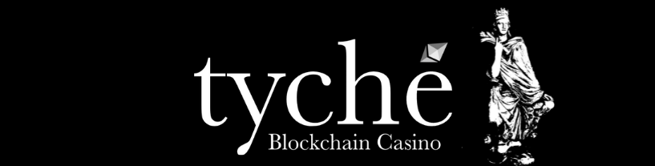

# Project Tyche: *Decentralized casino built on Ethereum blockchain* 

 The need for a fair gambling experience and our curiosity for the blockchain technology led us to the creation of Tyche.

Tyche offers a wide variety of games through its web platform and accepts payments only in Ether due to the fact that it is built on

Ethereum network, thus it inherits all of its features.

## WE ARE DIFFERENT. 

### Fair Odds

All game rules are completely transparent and immutable, making use of open source smart-contracts.

### Privacy

No need to provide any personal details to use our platform.

### Security

No hidden charges, you pay only what you consent.
 *Your funds stay yours.* 

### Quick transactions

Reliable and fixed transaction time guaranteed by the Ethereum Network. 
